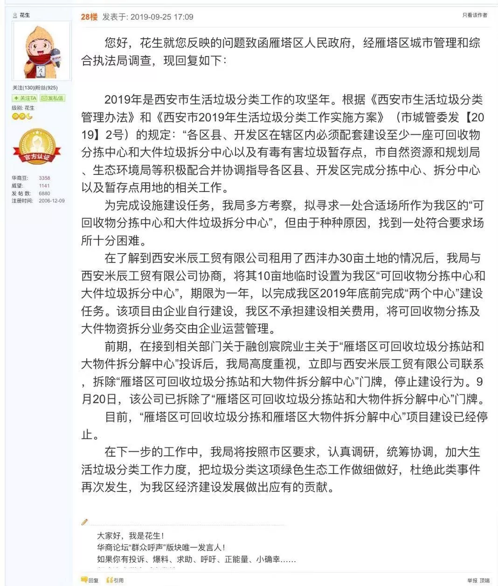
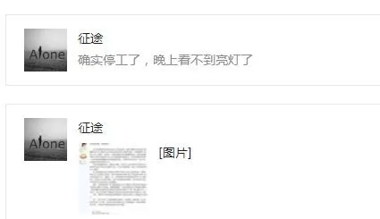

# 欢呼！官方回应：垃圾分拣项目建设已经停止  
注：转发自公众号： [Agile花园业委会]() 的 [欢呼！官方回应：垃圾分拣项目建设已经停止](https://mp.weixin.qq.com/s/sYT4nXycCESAJ0JyxOB2cA)  

对于融创、茅坡新城、雅居乐、金地等小区在内的10万居民来说，这几天可谓愁云惨淡万里凝，甚至有网友留言说这几天都精神异常，做梦都梦到垃圾中心在冒烟。不过，现在大家一颗悬着的心可以放下来了，甚至可以举杯庆祝和欢呼了，因为官方正式回应：“雁塔区可回收垃圾分拣和雁塔区大物件拆分解中心”项目建设已经停止。  
以下是官方回应的原文：  
> 2019年是西安市生活垃圾分类工作的攻坚年。根据《西安市生活垃圾分类管理办法》和《西安市2019年生活垃圾分类工作实施方案》（市城管委发【2019】2号）的规定：“各区县、开发区在辖区内必须配套建设至少一座可回收物分拣中心和大件垃圾拆分中心以及有毒有害垃圾暂存点，市自然资源和规划局、生态环境局等积极配合并协调指导各区县、开发区完成分拣中心、拆分中心以及暂存点用地的相关工作。  
为完成设施建设任务，我局多方考察，拟寻求一处合适场所作为我区的“可回收物分拣中心和大件垃圾拆分中心”，但由于种种原因，找到一处符合要求场所十分困难。  
在了解到西安米辰工贸有限公司租用了西沣办30亩土地的情况后，我局与西安米辰工贸有限公司协商，将其10亩地临时设置为我区“可回收物分拣中心和大件垃圾拆分中心”，期限为一年，以完成我区2019年底前完成“两个中心”建设任务。该项目由企业自行建设，我区不承担建设相关费用，将可回收物分拣及大件物资拆分业务交由企业运营管理。  
前期，在接到相关部门关于融创宸院业主关于“雁塔区可回收垃圾分拣站和大物件拆分解中心”投诉后，我局高度重视，立即与西安米辰工贸有限公司联系，拆除“雁塔区可回收垃圾分拣站和大物件拆分解中心”门牌，停止建设行为。9月20日，该公司已拆除了“雁塔区可回收垃圾分拣站和大物件拆分解中心”门牌。  
目前，“雁塔区可回收垃圾分拣和雁塔区大物件拆分解中心”项目建设已经停止。  
在下一步的工作中，我局将按照市区要求，认真调研，统筹协调，加大生活垃圾分类工作力度，把垃圾分类这项绿色生态工作做细做好，杜绝此类事件再次发生，为我区经济建设发展做出应有的贡献。  
  

该官方回复由华商论坛“群众呼声”版块唯一发言人花生发出，真实可靠。而且据网友“征途”反馈说：“确实停工了，晚上看不到亮灯了”。  
  
现在，大家相信了吧？该项目在我们的一致反对和批评的声音中真的停了，阶段性的胜利算不算？这就是人民的力量，正义的力量。当然，也说明政府还是能听得进群众呼声，能知错就改，顺应民意，还是有希望有前途，值得信赖的。  
所以，国还是要爱的，国庆节还是要开开心心地过的，本公众号这回也要红旗招展，热烈庆祝祖国七十岁生日，祝愿伟大的祖国更加繁荣富强，更加自由民主，早日实现中国梦，再现大唐盛世！  
  
