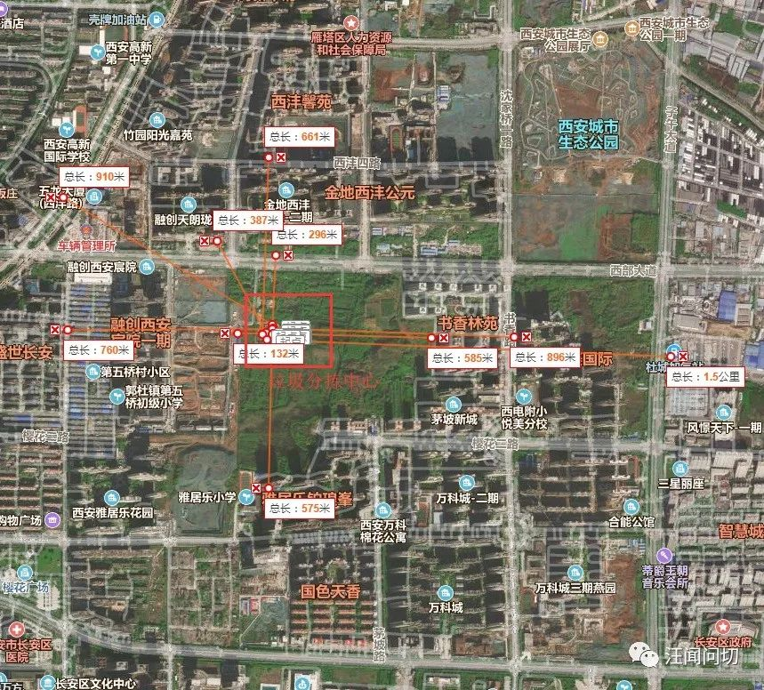

[转载自汪闻问切](https://mp.weixin.qq.com/s/ZaFzZOaER95bfczLGdd_Iw)

2019年10月27日上午10时许，西安市雁塔区政府门前涌现数百名西沣片区业主高唱国歌表达诉求。  

  
“支持垃圾分类，反对居民区建分拣站！！！”

“雁塔垃圾分拣站违建，无视西沣60万民意！！！

“反对垃圾分拣站，我们要学校！！”

据了解此次聚集民众来自西部大道附近，西沣路以东，子午大道以西附近小区，起因是今年9月份座一个整个雁塔区区级的垃圾分拣中心和垃圾拆解中心“悄悄”的在原本规划好的住宅用地上开建。这座雁塔区垃圾分拣中心距离最近的小区西安宸院二期住宅居住区域不足100米，面积高达30亩。而周围近60万居民聚居区教育资源异常紧张，在建的西安宸院总住户4700多户，2007年的规划中，该垃圾分拣中心的土地性质是教育住宅用地，原本规划建立学校的地方竟然改建垃圾分拣中心，周围数小区经过近2个月的各种合法方式向相关部门反馈情况，请求停止建设垃圾分拣中心另行选址，并规划建设学校以解决附近居民教育资源紧张的现状，但均未有确定答复，是以引发此次大规模群众集体活动。  
据了解西安城南是人口最密集的居住区之一，西沣片区同时也划入西安中央居住区范围，人口密度大，附近业主们持续反映，在西部大道西安宸院二期东侧不远处雁塔区的垃圾分拣中心正在建设，经多方网上投诉，并无统一回复和拆除迹象，附近居民无奈自发前往雁塔区政府表达诉求。  

从地图上来看，垃圾分拣站周边四周基本都是居民区其中包括融创西安宸院、融创天朗珑府、金地西沣公元、书香林苑、西沣馨院、茅坡新城，雅居乐·铂琅峰、雅居乐花园、雅居乐小学、郭杜第五桥小学等，数十万+居民和在校师生，周边居民对于这种大型垃圾分拣站建在居民区中间都持反对意见，也有不少网上投诉。  

！[图片](assets/53373c1bcb9cae306776fce290f3114a.jpg)
从区政府官方回复来看，不需要环评手续。

进一步了解到，2019年是西安市生活垃圾分类工作的攻坚年。根据《西安市生活垃圾分类管理办法》和《西安市2019年生活垃圾分类工作实施方案》（市城管委发【2019】2号）的规定：“各区县、开发区在辖区内必须配套建设至少一座可回收物分拣中心和大件垃圾拆分中心以及有毒有害垃圾暂存点。西安米辰工贸有限公司租用了西沣办30亩土地，政府与西安米辰工贸有限公司协商，将其10亩地临时设置为雁塔区“可回收物分拣中心和大件垃圾拆分中心”，期限为一年，以完成我区2019年底前完成“两个中心”建设任务。  
据了解，该垃圾站的地块30亩土地原本是教育与住宅用地，由西沣办租给西安米辰工贸有限公司，该公司在距离小区不足100米处建设垃圾分拣站，随后被叫停，目前已建成部分并未进行拆除。  
对于垃圾站建在居民区中间，一位从外地回乡置业的业主道出了自己的无奈和心声。

他说：“西安是一个充满“西引力”的地方，西部大道附近的居民都是被家乡吸引，励志为家乡做贡献的高科技人才，是回家乡置业支援西安发展的刚需家庭，更是扎根奋斗在社会主义各行各业的辛勤工作者，这样违规且无手续的建设活动是怎么悄无声息的出现的。是否存在未批先建，罔顾民意的行为？况且我们作为周边居民，我们从未收到从未见过任何官方下发或公示的环境评测，民意调查之类的文件！这无疑是在我们家门口安放的一颗“定时炸弹”！试问，在向着国际化迈进的西安，违规违法违背社会人情，偷偷修建这种存在污染的建筑，是哪些部门的决策？怎么会出现这种枉顾民生、枉顾民意的污染建筑。希望政府相关部门给与支持和调查，为群众分忧解难，坚决的取缔了关乎百姓健康、破坏环境的毒瘤。让我们普通老百姓真正感受到政府的执行力和亲和力，使我们更加真心实意地拥护党和政府，能更加努力去建设文明和谐的大西安。”  
在此前的9月21号，附近小区多名业主自发前往垃圾站位置发表反对意见。但无实质效果。  

最近根据陕西省出台相关规定，要求小区3000户以上需要配建小学和幼儿园。  

西沣片区属于城南中央居住区，人口密集，很多新建的大型小区都没有配件小学，教育资源十分紧张，比如融创西安宸院4700户居民竟没有配建小学，迎来的却是在教育用地上兴建大型垃圾分拣站。  
如此规模巨大的垃圾分拣站没有环评，没有民意调查及公示，手续不全的情况下就开工建设，在如今法律健全政务公开透明的情况下何以发生？这个规划是否合法合理合民意？是否有正式的雁塔区土地的分区控制性详细规划文件？2007年规划的教育住宅商业用地性质是否遭到偷偷篡改？  
该区域为三区交界处，相关部门是否存在互相推诿不作为的行为？出自各部门的回复无一相同，近两个月的各种途径投诉各部门竟没有针对此事件进行论证协商，如此“愚民”？  
该区域近60万居民，而小学只有4座其中一座在建，初中2座其中一座在建，预计未来2-3年后会上演数千适龄儿童无学可上的可怕景象，拿距离垃圾分拣中心最近的西安宸院来说，4700户居民竟没有规划小学，而相关部门不但不予解决反而把教育规划用地改建垃圾分拣站？竟如此的至民生于不顾？至祖国未来于不顾？希望政府相关部门尽快组织研讨会论证解决方案，给60万居民一个满意的答复，给下一代一个安全健康的成长环境！  
