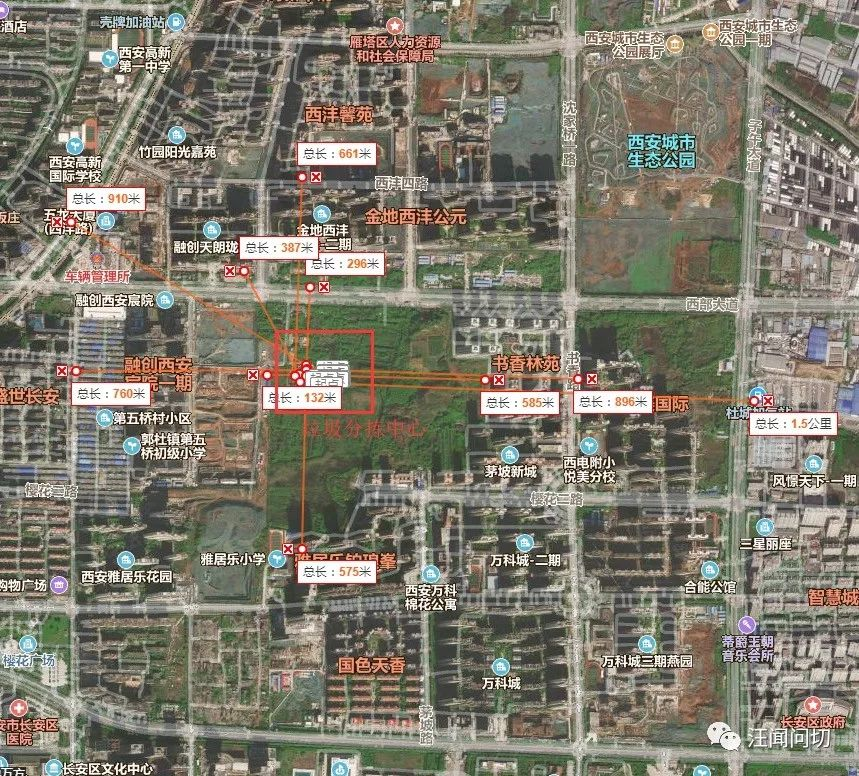

# 垃圾站边上的人们给西安市长的一封信  
>  
尊敬的李市长：  
您好！  

我们是雁塔区西部大道周边数十万业主中的一员，2017年西安市政府出台人才新政，出生在陕西而外打拼的我们，怀揣着对未来的美好期许，毅然决定回到这座土生土长，一直引以为豪的城市古都西安。  

回乡之后，我们举家迁到西安，并尽全家之力购买了西部大道附近的住宅。买房之初，开发商刻意隐瞒不利因素，之后才发现在西安宸院一起北边距离住宅不足50米处规划有超200平的垃圾压缩站（目前尚未建设,官方回应是2012年的规划），最近，雁塔区区级的垃圾分拣中心和垃圾拆解中心悄然在西部大道南侧原本规划好的住宅用地上施工建设。  

从地图上可以看到垃圾分拣中心处于西安市规划的“中央居住区”核心位置，距离西安宸院二期住宅居住区域不足100米，面积达1000多平米。 垃圾分拣站周边基本都是居民区包括融创西安宸院、融创天朗珑府、金地西沣公元、书香林苑、西沣馨院、茅坡新城，雅居乐·铂琅峰、雅居乐花园、雅居乐小学、郭杜第五桥小学等，100000+居民和在校师生。  

  

我们一致认为垃圾分拣中心和拆解中心主要对周围居民生活有严重影响：首先，分拣中心会有恶臭气体，尤其是在气温较高的时候，这些恶臭气体主要包括氨、硫化氢酮类、胺类、醛类主要通过人类的嗅觉来影响环境。其次设备运行及垃圾转运会产生噪音影响，还有对地下水资源及土壤的影响等。  

我们也从未收到从未见过任何官方下发或公示的环境评测，民意调查之类的文件（参照《生活垃圾转运技术规范》CJJ47，《区域性大型再生资源回收利用基地建设管理规范》SB/T10850，中华人民共和国环境保护法》、《环境影响评价公众参与与暂行办法》）向国际化迈进的西安，违规违法违背社会人情，偷偷修建这种存在污染的建筑，是哪些部门的决策？怎么会出现这种罔顾民生、罔顾民意的污染建筑？  

西部大道是西安规划“中央居住区”核心地带。人口密度大，且车流量大，在这里建立垃圾压缩分拣站，必然引起交通堵塞，让千千万万名回乡置业的科技工作者寒心。  

西安是一个充满“西引力”的地方，西部大道附近的居民都是被家乡吸引，励志为家乡做贡献的高科技人才，是回家乡置业支援西安发展的刚需家庭，更是扎根奋斗在社会主义各行各业的辛勤工作者，这样违规且无手续的建设活动是怎么悄无声息的出现的。  

是否存在未批先建，罔顾民意的行为？我们作为周边居民，此片区小区众多，人口密集，生产生活等消费潜力巨大，请政府慎重考虑研究。让我们普通老百姓真正感受到政府的执行力和亲和力，更加努力去建设文明和谐的大西安。  

真挚的希望李市长能关心一下我们这些满怀希望的返乡业主，衷心的祝愿您身体健康，工作顺心！  

此致敬礼  

盼复

西安市即将生活在垃圾站边的人们  
2019年9月24日  

------------------------------
## 后续:  
官方回应的文章：  
[《欢呼！官方回应：垃圾分拣项目建设已经停止》](./20190926_rep.md)  
2019年10月27日 维权 文章
[【社会】大都市西安雁塔垃圾分拣站违建，无视西沣片区 60万民意诉求](./20191027_page.md)
